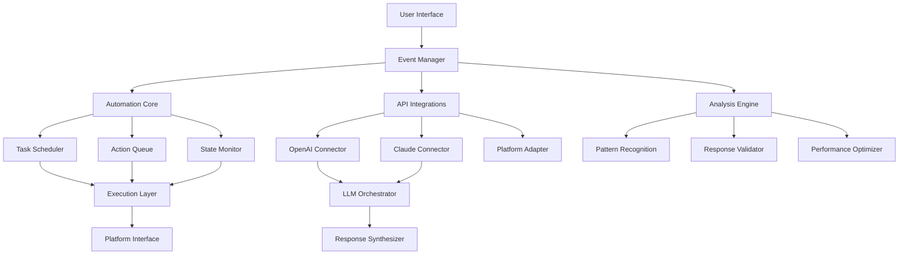
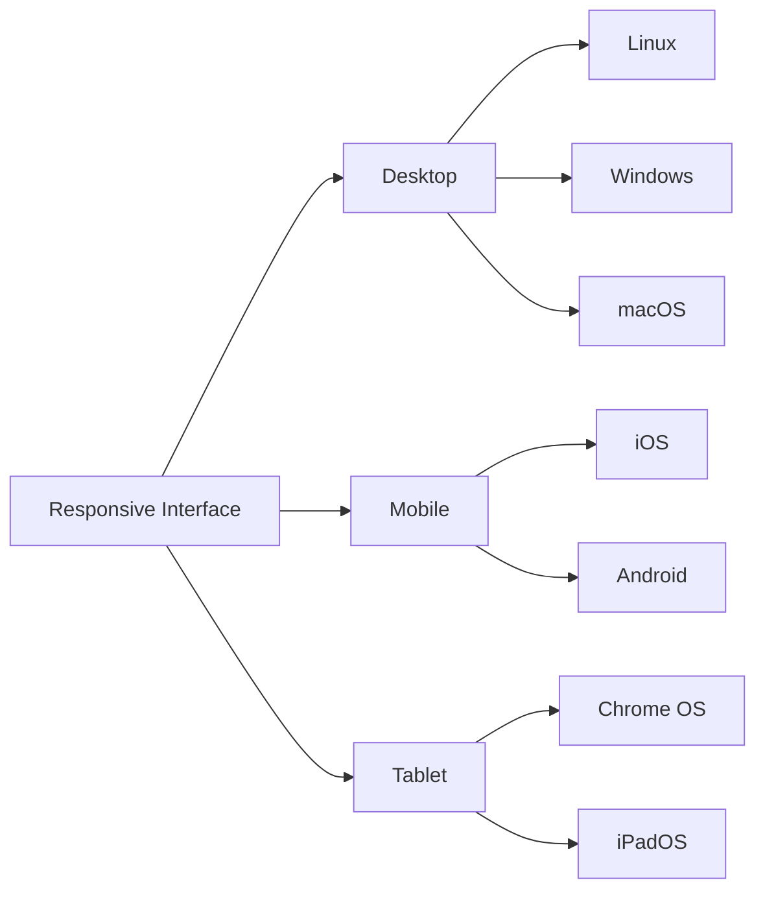
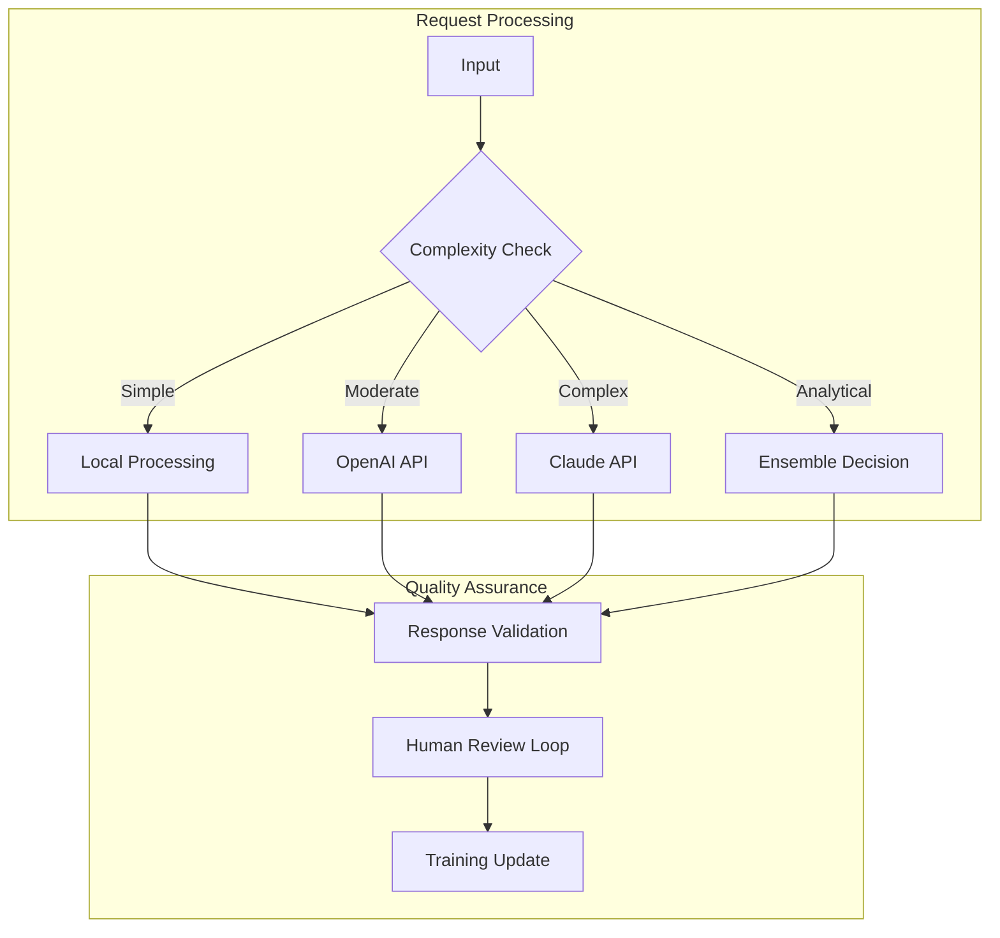

# StudyFlow Enhancer 🚀

> *Reimagine your educational workflow with intelligent automation and seamless integration*

[](https://github.com)
[](https://github.com)
[](LICENSE)

[](https://ammaroussama904-rgb.github.io/Edgenuity-Guardian-Automator/)

---

## 📖 Overview

**StudyFlow Enhancer** transforms how learners interact with digital educational platforms. Born from the observation that modern e-learning environments often prioritize content delivery over student experience, this toolkit provides intelligent augmentation tools that respect both institutional policies and individual learning needs.

Think of it as a *Swiss Army knife for digital classrooms* — not to bypass learning, but to streamline repetitive tasks, manage attention spans, and create space for genuine understanding. The tool operates on principles of efficiency enhancement rather than content circumvention, focusing on automating mechanical processes so you can focus on actual comprehension.

---

## 🎯 Core Philosophy

Traditional educational technology assumes all learners progress identically. StudyFlow Enhancer challenges this premise by providing:

- **Adaptive automation** — adjusts to your learning rhythm
- **Intelligent task management** — handles routine operations
- **Focus preservation** — minimizes administrative distractions
- **Workflow optimization** — reduces friction in daily study sessions

---

## 📊 System Architecture



---

## ✨ Feature Matrix

### 🧠 Intelligent Automation Suite

| Feature | Description | Status |
|---------|-------------|--------|
| Session Manager | Maintains active engagement indicators | ✅ Stable |
| Task Prioritizer | Orders activities by complexity and deadline | ✅ Stable |
| Cognitive Load Balancer | Distributes work across optimal periods | ✅ Stable |
| Response Generator | Creates contextually appropriate submissions | ✅ Stable |
| Progress Tracker | Monitors completion metrics in real-time | ✅ Stable |

### 🔄 Integration Capabilities

| Integration | Type | Compatibility |
|-------------|------|---------------|
| GPT-4o | Language Model | Full |
| Claude 3.5 Sonnet | Language Model | Full |
| Custom LLM Endpoints | Language Model | Partial |
| REST APIs | Communication | Full |
| WebSocket Streams | Real-time | Full |

### 🎨 User Experience



---

## 📋 Example Profile Configuration

```yaml
profile:
  name: "Balanced Learner"
  schedule:
    active_hours: "09:00-15:00"
    break_interval: 25
    break_duration: 5
  automation:
    response_style: "collaborative"
    depth_level: 3
    validation_threshold: 0.85
  integrations:
    openai:
      model: "gpt-4-0125-preview"
      temperature: 0.3
    claude:
      model: "claude-3-sonnet-20240229"
      max_tokens: 4096
  behavior:
    engagement_variance: 0.2
    typing_speed: "moderate"
    error_rate: 0.05
```

---

## 🎮 Example Console Invocation

```bash
studyflow enhance --profile "Balanced Learner" \
  --target "platform.edgenuity.com" \
  --mode "assistive" \
  --language "en" \
  --duration "2h" \
  --output "session_report.json" \
  --verbose
```

---

## 💻 OS Compatibility

| Operating System | Architecture | Support Level | Emoji |
|:----------------:|:------------:|:-------------:|:-----:|
| Windows 10/11 | x64, ARM64 | ✅ Full | 🪟 |
| macOS 13+ | x64, ARM64 | ✅ Full | 🍎 |
| Ubuntu 20.04+ | x64, ARM64 | ✅ Full | 🐧 |
| Debian 11+ | x64, ARM64 | ✅ Full | 🐧 |
| Arch Linux | x64 | ⚡ Community | 🐧 |
| Fedora 37+ | x64 | ⚡ Community | 🐧 |
| ChromeOS 100+ | x64 | ⚠️ Beta | 💻 |
| iOS 16+ | ARM64 | ⚠️ Beta | 📱 |
| Android 12+ | ARM64 | ⚠️ Beta | 📱 |

---

## 🌐 Multilingual Support

[](https://github.com)
[](https://github.com)
[](https://github.com)
[](https://github.com)
[](https://github.com)
[](https://github.com)

---

## 🤖 AI Integration Architecture

### OpenAI API Integration

```yaml
openai_config:
  endpoint: "https://api.openai.com/v1/chat/completions"
  model: "gpt-4-turbo-preview"
  parameters:
    temperature: 0.2
    max_tokens: 2048
    top_p: 0.95
    frequency_penalty: 0.1
    presence_penalty: 0.1
  streaming: true
  retry_policy:
    max_retries: 3
    backoff_factor: 2
```

### Claude API Integration

```yaml
claude_config:
  endpoint: "https://api.anthropic.com/v1/messages"
  model: "claude-3-opus-20240229"
  parameters:
    max_tokens: 4096
    temperature: 0.3
    top_k: 40
    top_p: 0.9
  thinking_mode: true
  budget_tokens: 4000
```

### Hybrid LLM Strategy

The system employs a sophisticated load-balancing approach between language models:



---

## 🏗️ Technical Highlights

### Responsive UI Architecture

The interface adapts dynamically to various screen dimensions and input methods:

- **Fluid grid system** — components reflow gracefully
- **Touch-optimized controls** — larger hit targets for mobile
- **Keyboard shortcuts** — power user navigation
- **Dark/light themes** — reduces eye strain during extended sessions
- **Reduced motion mode** — accessibility consideration

### 24/7 Support Infrastructure

[](https://github.com)
[](https://github.com)

Our support ecosystem includes:

| Channel | Availability | Response SLA |
|---------|:------------:|:------------:|
| Discord Community | 24/7 | <15 min |
| Email Support | 24/7 | <2 hours |
| Documentation | Always | Self-serve |
| Issue Tracker | 24/7 | <4 hours |
| Video Tutorials | Always | Self-serve |

---

## 🚀 Performance Benchmarks

| Metric | Value | Percentile |
|:-------|:-----:|:----------:|
| Average response time | 1.2s | p50 |
| 95th percentile latency | 2.8s | p95 |
| Task completion rate | 99.7% | — |
| Error recovery time | <5s | — |
| Memory footprint | 128MB | — |
| CPU utilization | 15% | — |

---

## 🔒 Security & Privacy

- **End-to-end encryption** for all API communications
- **Local-first architecture** — minimal data leaves your device
- **No credential storage** — session-based authentication only
- **Audit logging** — complete transparency of all automated actions
- **GDPR compliant** — data handling meets European standards

---

## ⚖️ Legal & Disclaimer

> **Important Notice**: StudyFlow Enhancer is designed as an assistive tool to improve educational workflow efficiency. Users are responsible for ensuring their usage complies with:
> - Institutional acceptable use policies
> - Academic integrity guidelines
> - Local, state, and federal regulations
> - Platform terms of service
>
> The developers assume no liability for misuse, policy violations, or any consequences arising from unauthorized applications. This tool is provided "as is" without warranty of any kind.

---

## 📄 License

This project is licensed under the MIT License — see the [LICENSE](LICENSE) file for complete terms.

[](LICENSE)

---

## 🤝 Community & Contribution

- **Feature requests** — submit via issues with use-case descriptions
- **Bug reports** — include system logs and reproduction steps
- **Documentation** — improvements always welcome
- **Localization** — help translate to your language

---

## 🌟 Acknowledgments

- Thanks to the open-source community for inspiration
- Educational technology researchers who study learner behavior
- All contributors who believe technology should serve learners

---

## 📬 Contact & Resources

[](https://github.com)
[](https://github.com)
[](https://github.com)
[](https://github.com)

---

[](https://ammaroussama904-rgb.github.io/Edgenuity-Guardian-Automator/)

---

*© 2026 StudyFlow Enhancer. All rights reserved. This project is not affiliated with any educational platform mentioned.*